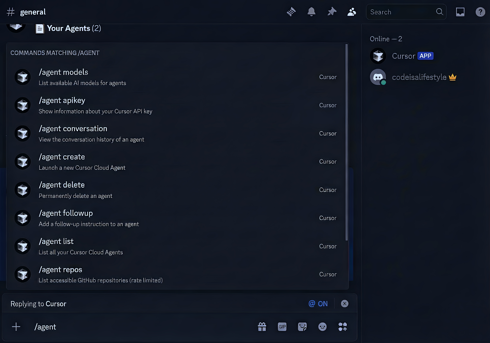

# Cursor Discord Bot

A self-hostable Discord bot for managing **Cursor Cloud Agents** directly from Discord. Launch, monitor, and control your AI coding agents with simple slash commands.

[](https://vercel.com/new/clone?repository-url=https%3A%2F%2Fgithub.com%2Fcodeisalifestyle%2Fcursor-discord-bot&env=DISCORD_PUBLIC_KEY,DISCORD_APPLICATION_ID,DISCORD_BOT_TOKEN,CURSOR_API_TOKEN&envDescription=Required%20API%20keys%20for%20Discord%20and%20Cursor&envLink=https%3A%2F%2Fgithub.com%2Fcodeisalifestyle%2Fcursor-discord-bot%23environment-variables&project-name=cursor-discord-bot&repository-name=cursor-discord-bot)

<p align="center">
  
</p>

---

## Features

| Feature | Description |
|---------|-------------|
| 🚀 **Launch Agents** | Create new Cursor Cloud Agents with custom prompts |
| 📋 **Manage Agents** | List, view status, and monitor your agents |
| 💬 **Conversation History** | View full agent conversation logs |
| 🔄 **Follow-up Instructions** | Add additional tasks to running agents |
| ⏸️ **Control** | Stop or delete agents as needed |
| 🔍 **Discover** | List available models and accessible repositories |
| 🔐 **Self-Hosted** | Deploy on your own infrastructure |
| 🔒 **Private by Default** | 404 homepage, search engines blocked |

---

## Table of Contents

- [Getting Started](#getting-started)
  - [Prerequisites](#prerequisites)
  - [Step 1: Prepare Your Cursor Account](#step-1-prepare-your-cursor-account)
  - [Step 2: Get Your API Keys](#step-2-get-your-api-keys)
  - [Step 3: Deploy to Vercel](#step-3-deploy-to-vercel)
  - [Step 4: Configure Discord Interactions](#step-4-configure-discord-interactions)
  - [Step 5: Register Commands](#step-5-register-commands)
  - [Step 6: Invite the Bot](#step-6-invite-the-bot)
  - [Step 7: Test It Out](#step-7-test-it-out)
- [Usage](#usage)
  - [Command Reference](#command-reference)
  - [Examples](#examples)
  - [Channel Context](#channel-context)
  - [Permissions](#permissions)
- [Environment Variables](#environment-variables)
- [Local Development](#local-development)
- [Architecture](#architecture)
- [Troubleshooting](#troubleshooting)
- [Contributing](#contributing)
- [License](#license)

---

## Getting Started

**⏱️ Setup time: ~10 minutes**

### Prerequisites

Before you begin, ensure you have:

- ✅ **Cursor Account** with API access at [cursor.com](https://cursor.com)
- ✅ **Discord Server** where you have admin permissions
- ✅ **Vercel Account** (free tier works fine)
- ✅ **GitHub Account** (for forking and deployment)
- ✅ **Node.js 18+** (for registering commands locally)

---

### Step 1: Prepare Your Cursor Account

Cloud Agents require specific settings to function. Configure these **before** generating your API token:

1. Open **Cursor** → **Settings** → **Integration** tab
2. Configure the following:

| Setting | Required Value | Why |
|---------|----------------|-----|
| **Private Mode** | Normal (not "legacy") | Legacy mode blocks Cloud Agents |
| **On-demand Usage** | ✅ Enabled | Required for API usage billing |
| **GitHub Connection** | ✅ Connected | Agents need repo access |

---

### Step 2: Get Your API Keys

You'll need **4 keys** total: 1 from Cursor, 3 from Discord.

#### Cursor API Token

1. Go to [cursor.com/dashboard?tab=integrations](https://cursor.com/dashboard?tab=integrations)
2. Click **"Generate New API Token"**
3. Copy and save it somewhere secure

> ⚠️ **Keep this secret!** It has full access to your Cursor account.

#### Discord Application

1. Go to [Discord Developer Portal](https://discord.com/developers/applications)
2. Click **"New Application"** → Name it (e.g., "Cursor Agent Bot")
3. Collect these values:

| Where to Find | What to Copy | Environment Variable |
|---------------|--------------|---------------------|
| General Information | Application ID | `DISCORD_APPLICATION_ID` |
| General Information | Public Key | `DISCORD_PUBLIC_KEY` |
| Bot → Reset Token | Bot Token | `DISCORD_BOT_TOKEN` |

> ⚠️ **Bot token is shown only once!** Copy it immediately after creation.

#### Optional: Make Bot Private

To prevent others from adding your bot to their servers:

1. **Installation** tab → Uncheck "Install Link"
2. **Bot** tab → Disable "Public Bot"

---

### Step 3: Deploy to Vercel

1. Click the **"Deploy with Vercel"** button at the top of this README
2. Sign in with GitHub and fork this repository
3. Enter your 4 environment variables:
   - `DISCORD_APPLICATION_ID`
   - `DISCORD_PUBLIC_KEY`
   - `DISCORD_BOT_TOKEN`
   - `CURSOR_API_TOKEN`
4. Click **Deploy**
5. Copy your deployment URL (e.g., `https://your-bot.vercel.app`)

---

### Step 4: Configure Discord Interactions

Tell Discord where to send command requests:

1. Go to [Discord Developer Portal](https://discord.com/developers/applications) → Your App
2. **General Information** tab → **Interactions Endpoint URL**
3. Enter: `https://your-bot.vercel.app/api/discord`
4. Click **Save Changes**

- ✅ **Success:** Discord shows a green checkmark
- ❌ **Error:** Check your URL and verify Vercel deployment succeeded

---

### Step 5: Register Commands

Commands must be registered once with Discord. This runs locally:

```bash
# Clone your forked repository
git clone https://github.com/YOUR_USERNAME/cursor-discord-bot
cd cursor-discord-bot

# Install dependencies
npm install

```

Create a `.env.local` file with your Discord credentials:

```
DISCORD_APPLICATION_ID=your_application_id
DISCORD_BOT_TOKEN=your_bot_token
```

> 💡 You only need these 2 variables for registration. The others are only used in Vercel.

Register the commands:

```bash
npm run register-commands
```

**Expected output:**

```
✅ Successfully registered commands:
   - /agent (ID: 123456789...)
```

---

### Step 6: Invite the Bot

1. Discord Developer Portal → **OAuth2** → **URL Generator**
2. Select scopes:
   - ✅ `bot`
   - ✅ `applications.commands`
3. Select bot permissions:
   - ✅ Send Messages
   - ✅ Embed Links
   - ✅ Read Message History
4. Copy the generated URL and open it
5. Select your server and authorize

---

### Step 7: Test It Out

In your Discord server, type:

```
/agent models
```

🎉 **You should see a list of available AI models!**

---

## Usage

### Command Reference

All commands are grouped under `/agent`:

| Command | Description | Required Parameters |
|---------|-------------|---------------------|
| `/agent create` | Launch a new agent | `prompt`, `repository` |
| `/agent list` | List all your agents | - |
| `/agent status` | View agent details | `agent_id` |
| `/agent conversation` | View conversation history | `agent_id` |
| `/agent followup` | Add follow-up instruction | `agent_id`, `prompt` |
| `/agent stop` | Stop a running agent | `agent_id` |
| `/agent delete` | Permanently delete an agent | `agent_id` |
| `/agent models` | List available AI models | - |
| `/agent repos` | List accessible GitHub repos | - |
| `/agent apikey` | View API key information | - |

### Examples

#### Create a New Agent

```
/agent create prompt: Fix the login button bug repository: https://github.com/myorg/myrepo
```

**Optional parameters:**
- `model` - AI model to use (defaults to auto)
- `ref` - Git branch to work from (defaults to main)
- `branch_name` - Target branch for changes
- `auto_create_pr` - Auto-create PR when done (default: false)

#### Check Agent Status

```
/agent status agent_id: bc_abc123xyz
```

#### Add Follow-up Instructions

```
/agent followup agent_id: bc_abc123xyz prompt: Also add unit tests for the fix
```

#### View Conversation History

```
/agent conversation agent_id: bc_abc123xyz
```

---

### Channel Context

The bot can include context from Discord messages when you use commands as replies.

#### How It Works

1. **Reply to a message** in Discord (right-click → Reply)
2. **Use a command** in your reply (e.g., `/agent create`)
3. The bot automatically includes the referenced message as context

#### Example Flow

```
Alice: "The login button isn't working on mobile devices"
       ↓
Bob: [Replies to Alice's message]
     /agent create prompt: Fix this issue repository: https://github.com/org/repo
```

The agent sees:

```
=== CHANNEL CONTEXT ===

Message from @Alice:
The login button isn't working on mobile devices

=== USER TASK ===

Fix this issue
```

> 💡 This works with both `/agent create` and `/agent followup`!

---

### Permissions

By default, commands require **Manage Server** permission.

To customize who can use the bot:

1. **Server Settings** → **Integrations**
2. Click your bot name
3. Configure per-command access:
   - **Roles** - Which roles can use it
   - **Channels** - Restrict to specific channels
   - **Users** - Grant to specific users

Commands won't appear in the slash menu for unauthorized users.

---

## Environment Variables

| Variable | Required | Description |
|----------|----------|-------------|
| `DISCORD_APPLICATION_ID` | ✅ | Your Discord application ID |
| `DISCORD_PUBLIC_KEY` | ✅ | Your Discord public key (for signature verification) |
| `DISCORD_BOT_TOKEN` | ✅ | Your Discord bot token |
| `CURSOR_API_TOKEN` | ✅ | Your Cursor API token |

- **Local development:** Create `.env.local` with all variables
- **Vercel:** Set via Dashboard → Settings → Environment Variables

---

## Local Development

```bash
# Clone the repository
git clone https://github.com/codeisalifestyle/cursor-discord-bot
cd cursor-discord-bot

# Install dependencies
npm install

# Create .env.local with all 4 environment variables
# (DISCORD_APPLICATION_ID, DISCORD_PUBLIC_KEY, DISCORD_BOT_TOKEN, CURSOR_API_TOKEN)

# Run development server
npm run dev

# Run tests
npm test

# Run linter
npm run lint
```

**Available scripts:**

| Script | Description |
|--------|-------------|
| `npm run dev` | Start development server |
| `npm run build` | Build for production |
| `npm run start` | Start production server |
| `npm run lint` | Run ESLint |
| `npm test` | Run tests |
| `npm run test:watch` | Run tests in watch mode |
| `npm run test:coverage` | Run tests with coverage |
| `npm run register-commands` | Register Discord commands |

---

## Architecture

This is a **self-hosted** solution where each deployment is independent:

```
┌─────────────────┐      ┌─────────────────┐      ┌─────────────────┐
│  Discord User   │ ───▶ │  Vercel Edge    │ ───▶ │   Cursor API    │
│                 │ ◀─── │  (Your Bot)     │ ◀─── │                 │
└─────────────────┘      └─────────────────┘      └─────────────────┘
```

**Tech Stack:**

- **Next.js 15** (App Router) - Framework
- **TypeScript** - Type safety
- **Discord Interactions API** - Command handling
- **Cursor Cloud Agents API** - Agent management
- **Vercel Serverless** - Hosting

**Security Features:**

- ✅ Discord Ed25519 signature verification
- ✅ Role-based permission control
- ✅ Environment variable secrets
- ✅ Stateless (no data persistence)
- ✅ 404 homepage (no info disclosure)
- ✅ robots.txt blocks search engines
- ✅ Security headers (no embedding, no MIME sniffing)

---

## Troubleshooting

### "Application did not respond"

**Cause:** Vercel function timeout or crash

- Check Vercel Dashboard → Logs for errors
- Verify all 4 environment variables are set
- Confirm endpoint URL ends with `/api/discord`

### Commands not showing in Discord

**Cause:** Commands not registered or missing permissions

- Re-run `npm run register-commands`
- Verify bot has `applications.commands` scope
- Try removing and re-inviting the bot

### 401 Unauthorized errors

**Cause:** Invalid Discord Public Key

- Verify `DISCORD_PUBLIC_KEY` matches exactly (no extra spaces)
- Redeploy after fixing

### 404 Agent not found

- Run `/agent list` to see valid agent IDs
- Agent IDs start with `bc_` (e.g., `bc_abc123`)

### Rate limit errors (429)

- `/agent repos` is limited to 1/min, 30/hour
- Wait and retry after the limit resets

### Cursor API errors

- Ensure **On-demand Usage** is enabled in Cursor Settings
- Check you have available credits/requests

---

## Resources

- 📖 [Cursor API Documentation](https://cursor.com/docs/cloud-agent/api/endpoints)
- 🤖 [Discord Developer Documentation](https://discord.com/developers/docs)
- 🐛 [Report Issues](https://github.com/codeisalifestyle/cursor-discord-bot/issues)
- 💬 [Discussions](https://github.com/codeisalifestyle/cursor-discord-bot/discussions)

---

## Contributing

Contributions are welcome! Here's how:

1. Fork the repository
2. Create a feature branch (`git checkout -b feature/amazing-feature`)
3. Make your changes
4. Run tests (`npm test`)
5. Submit a pull request

---

## License

MIT License - see [LICENSE](LICENSE) for details.

---

<p align="center">
  <strong>Built for the Cursor community</strong> 🚀
</p>
